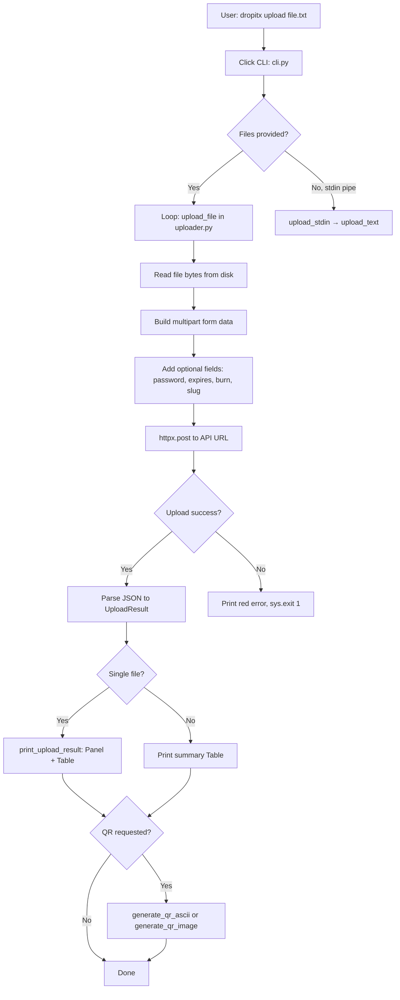
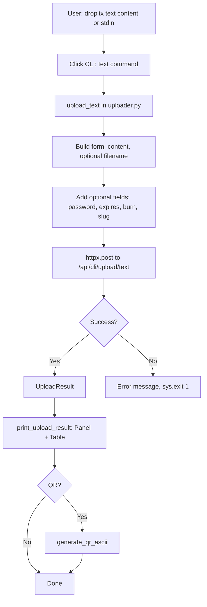
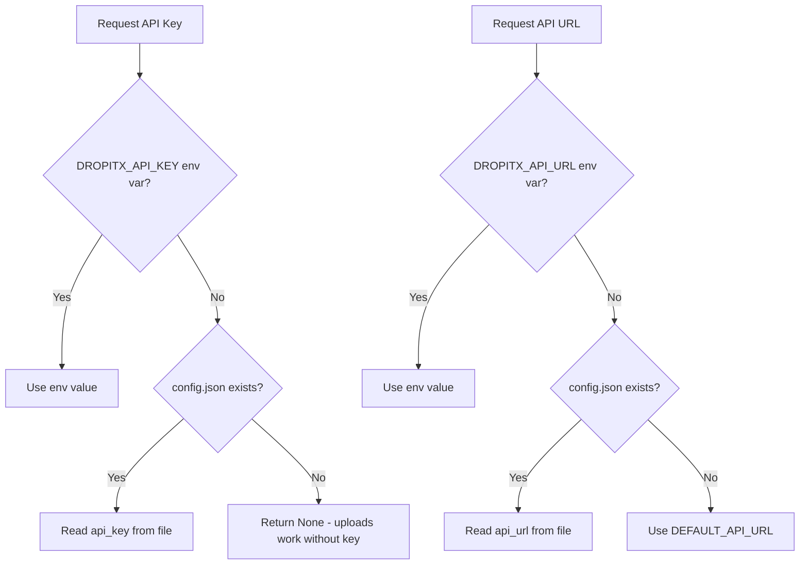

# DropItX CLI - System Architecture

## Big Picture

DropItX CLI is a **thin HTTP client** with terminal UX polish. It translates command-line invocations into multipart/form-data POST requests to the DropItX API, renders responses using Rich, and provides optional QR code generation.

**Architecture Style:** Client-server (CLI is client, DropItX API is server)  
**Communication:** HTTP/HTTPS (httpx)  
**State Management:** Stateless (auth via header, config via JSON file)

## Component Overview

```
┌─────────────────────────────────────────────────────────────┐
│                         Terminal                              │
│  User commands: dropitx upload, echo hi | dropitx, etc.      │
└────────────────────────┬────────────────────────────────────┘
                         │
                         ▼
┌─────────────────────────────────────────────────────────────┐
│                    Click CLI (cli.py)                        │
│  • Command parsing (upload, text, config, qr)                │
│  • Global options (--password, --expires, --burn, --slug)   │
│  • Pipe detection (stdin.isatty())                           │
│  • Output rendering (Rich Panels & Tables)                   │
└─────┬─────────────┬─────────────┬─────────────┬──────────────┘
      │             │             │             │
      ▼             ▼             ▼             ▼
┌──────────┐  ┌──────────┐  ┌──────────┐  ┌──────────┐
│ Uploader │  │  Config  │  │    QR    │  │  Stdin   │
│          │  │          │  │          │  │          │
│ • upload │  │ • env    │  │ • ASCII  │  │ • sys.   │
│   _file  │  │   vars   │  │ • Image  │  │   stdin. │
│ • upload │  │ • JSON   │  │ • Fallback│  │   read() │
│   _text  │  │   file   │  │          │  │          │
│ • upload │  │ • mask   │  │          │  │          │
│   _stdin │  │   key    │  │          │  │          │
└─────┬────┘  └─────┬────┘  └─────┬────┘  └─────┬─────┘
      │             │             │             │
      └─────────────┴─────────────┴─────────────┘
                    │
                    ▼
┌─────────────────────────────────────────────────────────────┐
│                  httpx HTTP Client                           │
│  • POST /api/cli/upload (multipart)                          │
│  • POST /api/cli/upload/text (form)                          │
│  • Optional X-API-Key header                                 │
│  • Timeouts: 300s (file), 60s (text)                         │
└────────────────────────┬────────────────────────────────────┘
                         │
                         ▼
┌─────────────────────────────────────────────────────────────┐
│                  DropItX API (Server)                        │
│  • Validates auth (optional)                                  │
│  • Stores files/text                                         │
│  • Returns UploadResult JSON                                  │
└─────────────────────────────────────────────────────────────┘
```

## Command Flow

### Entry Point
```python
# pyproject.toml
[project.scripts]
dropitx = "dropitx.cli:cli"

# cli.py
@click.group(invoke_without_command=True)
def cli(ctx, password, expires, burn, slug, qr, qr_file):
    if ctx.invoked_subcommand is None:
        if not sys.stdin.isatty():  # Pipe detected
            upload_stdin(password, expires, burn, slug) → print_upload_result()
        else:
            click.echo(ctx.get_help())
```

### Subcommand Dispatch
```
cli() group
├── upload [FILES]... → upload_file() loop → print_upload_result()
├── text CONTENT → upload_text() → print_upload_result()
├── config ACTION → config_cmd() → load/save config
└── qr URL → qr() → generate_qr_ascii() or generate_qr_image()
```

## Upload Pipeline

### File Upload Path


### Text Upload Path


### Stdin Upload Path
```mermaid
graph LR
    A[Pipe: echo hi | dropitx] --> B[cli.py: bare invocation]
    B --> C{stdin.isatty?}
    C -->|No, pipe| D[upload_stdin]
    C -->|Yes, TTY| E[Show help]
    D --> F[sys.stdin.read]
    F --> G[Delegate to upload_text]
    G --> H[Continue text upload path]
```

## Config Resolution

### Precedence Chain


### Config File Structure
```json
{
  "api_key": "sk_xxxxxxxxxxxxx",
  "api_url": "https://dropitx-api.onrender.com"
}
```
**Location:** `~/.dropitx/config.json`  
**Mutation:** Direct JSON overwrite via `load_config()` → `save_config()`

## API Contract

### Endpoints

**File Upload:**
```
POST {api_url}/api/cli/upload
Content-Type: multipart/form-data

Files:
  file: <binary data>

Form fields:
  password: <optional string>
  expires: <optional string, e.g., "1h", "7d">
  burn: <literal string "true">
  slug: <optional string>

Headers:
  X-API-Key: <optional, if set>

Response:
{
  "url": "https://dropitx.com/s/abc123",
  "slug": "abc123",
  "filename": "file.txt",
  "size": 1024,
  "deleteToken": "xyz789",  # camelCase → delete_token
  "expires_at": "2026-06-29T12:00:00Z",
  "burn_after_reading": false,
  "password_protected": false
}
```

**Text Upload:**
```
POST {api_url}/api/cli/upload/text
Content-Type: application/x-www-form-urlencoded

Form fields:
  content: <text string>
  filename: <optional>
  password: <optional>
  expires: <optional>
  burn: <optional>
  slug: <optional>

Response: same as file upload
```

### Field Mapping
```python
# Client → Server
client.burn = True → data["burn"] = "true"  # String, not boolean
client.slug = "my-file" → data["slug"] = "my-file"
client.password = "secret" → data["password"] = "secret"

# Server → Client
response["deleteToken"] → result.delete_token  # camelCase → snake_case
response["expires_at"] → result.expires_at  # already snake_case
```

## Optional QR Code

### Dependency Check
```python
try:
    import qrcode
    HAS_QRCODE = True
except ImportError:
    HAS_QRCODE = False
```

### ASCII QR (Fallback)
```python
generate_qr_ascii(url):
    if not HAS_QRCODE:
        return "[Text placeholder - qrcode not installed]"
    return qrcode.make(url, error_correction=qrcode.ERROR_CORRECT_L).print_ascii(invert=True)
```

### Image QR (Requires qrcode[pil])
```python
generate_qr_image(url, output_path):
    if not HAS_QRCODE:
        return False  # Caller surfaces pip install message
    img = qrcode.make(url, error_correction=qrcode.ERROR_CORRECT_M, box_size=10, border=4)
    img.save(output_path)
    return True
```

## Output Layer

### Single File Success
```python
print_upload_result(result):
    Table(show_header=False, box=None)
    └── Rows: URL, Slug, Filename, Delete Token, Expires?, Burn?, Password?
    Panel with green border
    └── Contains the Table
    Optional ASCII QR below
```

### Multi-File Summary
```python
Table(title="Upload Results")
├── Column "File" (cyan)
├── Column "URL" (green)
└── Column "Slug"
```

### Config Display
```python
Table(title="DropItX Configuration")
├── Column "Setting" (cyan)
└── Column "Value"
    └── API URL
    └── API Key (masked: "sk_abc...xyz")
```

### Error Output
```python
console.print("[red]Error: {message}[/red]")
sys.exit(1)
```

## Terminal UX Conventions

### Color Semantics
- **Green** (`[green]`, `[bold green]`): Success states, upload complete
- **Red** (`[red]`): Errors, failures
- **Cyan** (`[cyan]`, `[bold cyan]`): Keys, labels, filenames
- **Dim** (`[dim]`): Hints, metadata, less important info
- **Yellow** (`[yellow]`): Warnings (e.g., missing optional deps)

### Masking
```python
# API key display in config show
masked = api_key[:8] + "..." + api_key[-4:] if len(api_key) > 12 else "***"
# "sk_abcde...xyz"
```

### Secure Prompts
```python
password = click.prompt("Password", hide_input=True, confirmation_prompt=True)
# Type hidden, confirmation required
```

## State Management

### Client-Side State
- **Config file:** `~/.dropitx/config.json` (persistent)
- **Env vars:** Session-scoped, highest precedence
- **No runtime state:** Each invocation is independent
- **Test isolation:** Tests use `monkeypatch` to redirect config to tmp paths

### Server-Side State
- **File storage:** Managed by DropItX API
- **Metadata:** Expiration, burn flag, password (stored server-side)
- **Delete tokens:** Returned by API, not stored by CLI

## CI Pipeline

### GitHub Actions Workflow
```mermaid
graph LR
    A[Push to main / PR] --> B[checkout@v4]
    B --> C[setup-python 3.9 / 3.12]
    C --> D[pip install -e .[dev,qr]]
    D --> E[pytest -q]
    E --> F[CLI smoke test]
    F --> G{All pass?}
    G -->|Yes| H[Green check]
    G -->|No| I[Red X]
```

**Workflow:** `.github/workflows/ci.yml`  
**Matrix:** Python 3.9 + 3.12  
**Status:** Green on both versions  
**Test Count:** 13 tests, network-free

---

**Last Updated:** 2026-06-28  
**Architecture Style:** Stateless HTTP client with terminal UX  
**Repository:** https://github.com/phuongddx/dropitx-cli (public, MIT)  
**CI Status:** All 13 tests passing on Python 3.9 and 3.12
